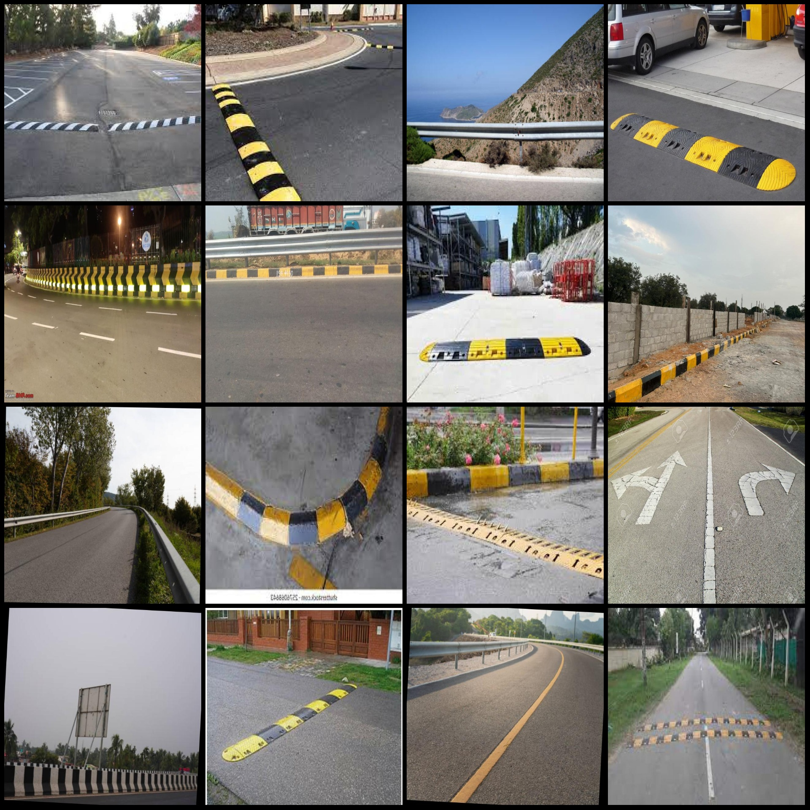
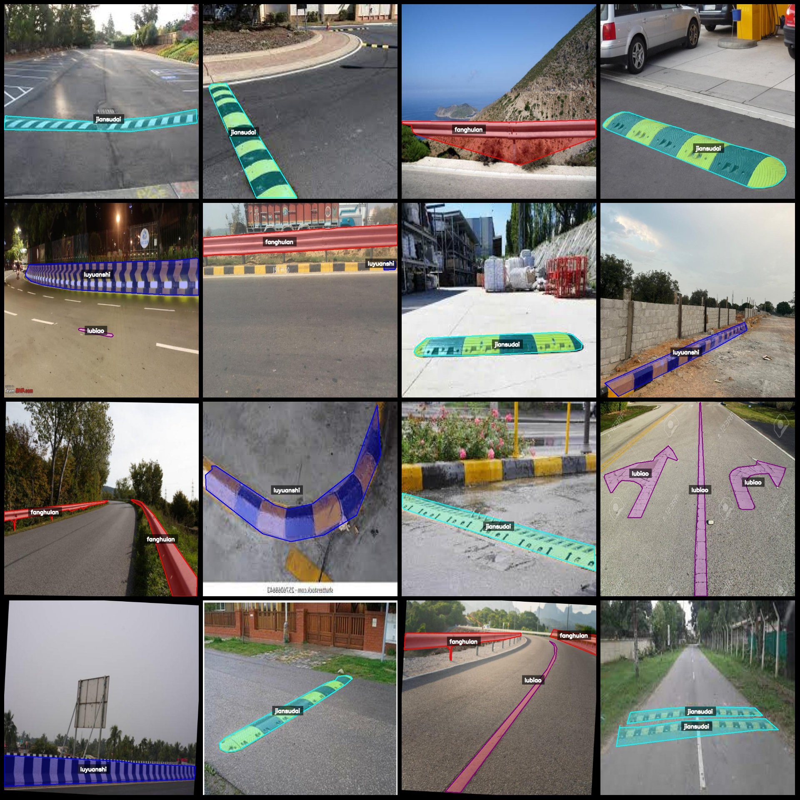
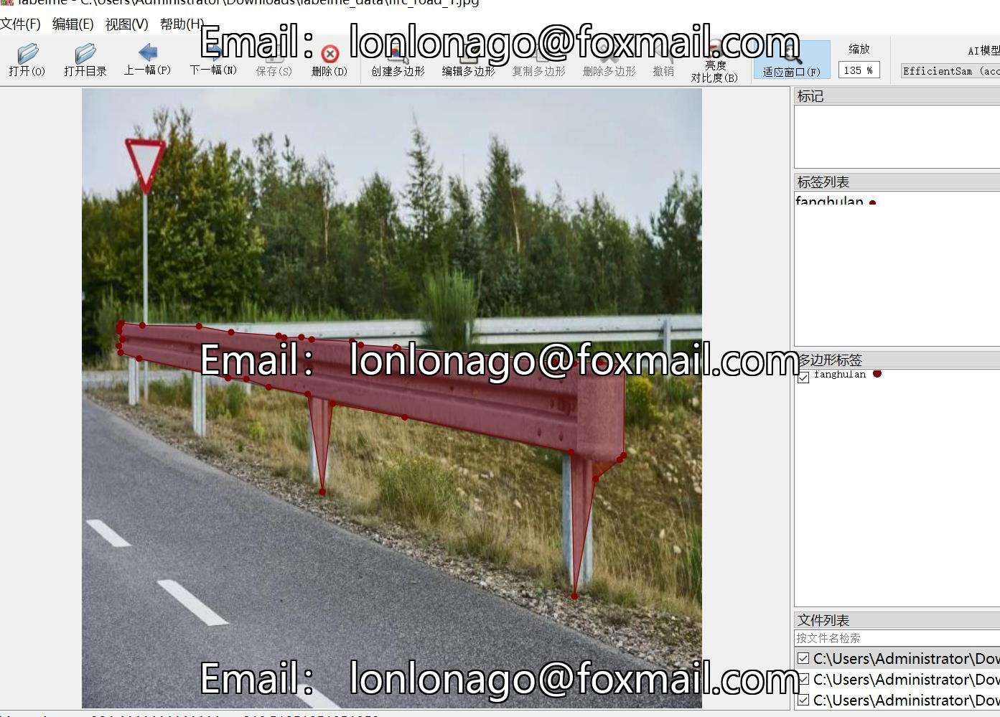

# Intelligent Traffic Road Fence, Road Marking, and Edge Paving Identification and Segmentation Dataset (labelme format) - 1393 images in 4 categories

Dataset format: labelme format (excluding mask files, only containing jpg images and corresponding json files)
Number of images (number of jpg files): 1393
Number of annotations (json file number): 1393
Number of annotation categories: 4
Annotation category names: ["fanghulan", "jiansudai", "lubiao", "luyuanshi"]
Number of boxes per category:
- fanghulan (traffic fence) count = 456
- jiansudai (speed bump) count = 394
- lubiao (sign) count = 407
- luyuanshi (edge paving) count = 484
Total boxes: 1741
Annotation tool used: labelme v5.5.0
Image resolution: 640x640
Annotation rules: Polygons are drawn around the category labels
Important note: The dataset can be opened and edited using labelme; for json datasets, they need to be converted into yolo or coco format for semantic segmentation or instance segmentation.
Special declaration: This dataset does not guarantee the accuracy of the trained models or weight files.
Image preview:
Annotation examples:
Randomly selected 16 images for illustration:
Annotation drawing results:
Labelme editing example images:

## Images

Here is a pay link on Stripe ( https://buy.stripe.com/3cs8yP7sY87d0vu9AB ). Please contact me lonlonago@foxmail.com after funding $89, and I will send you a complete data files , thank you!

